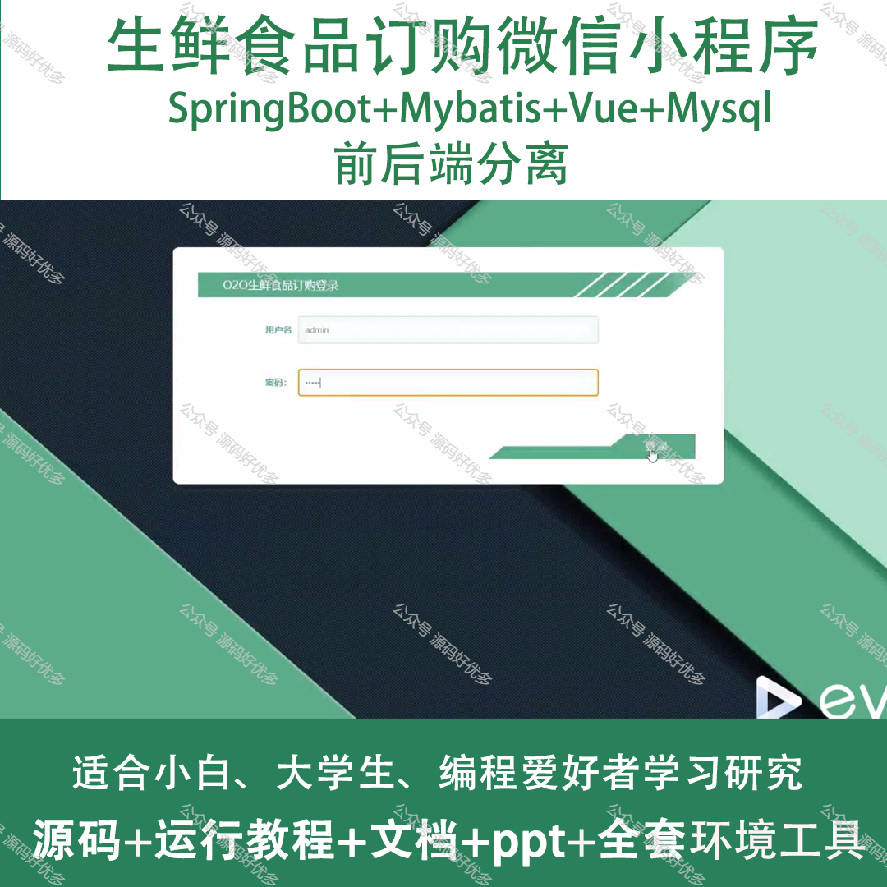
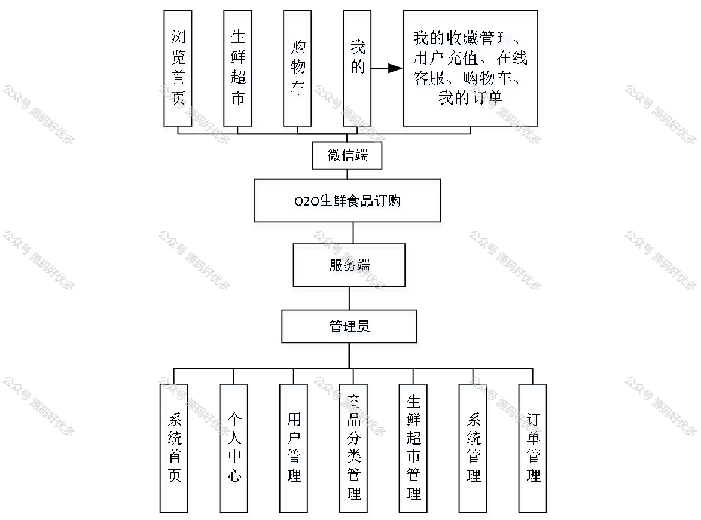
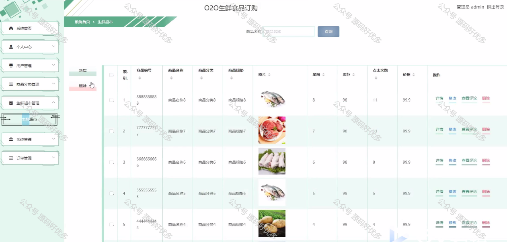
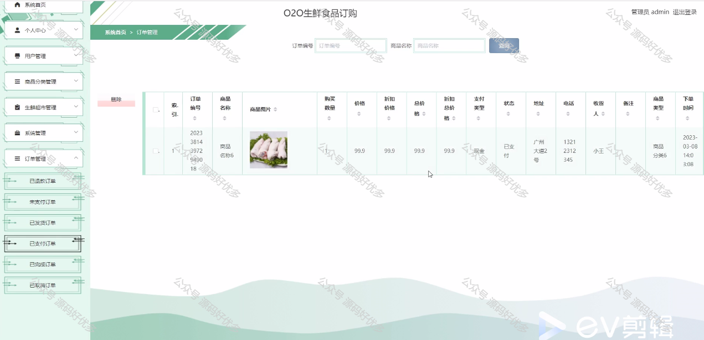
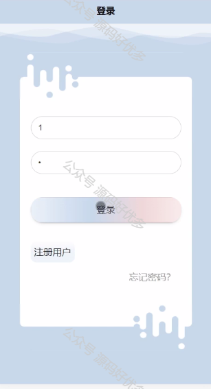
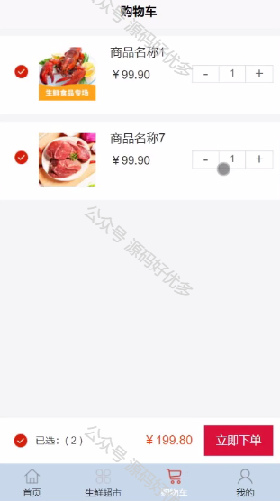
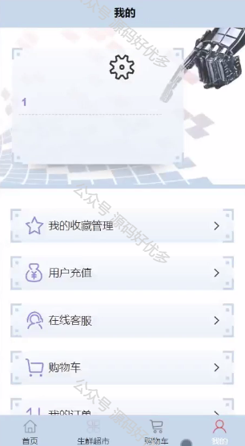
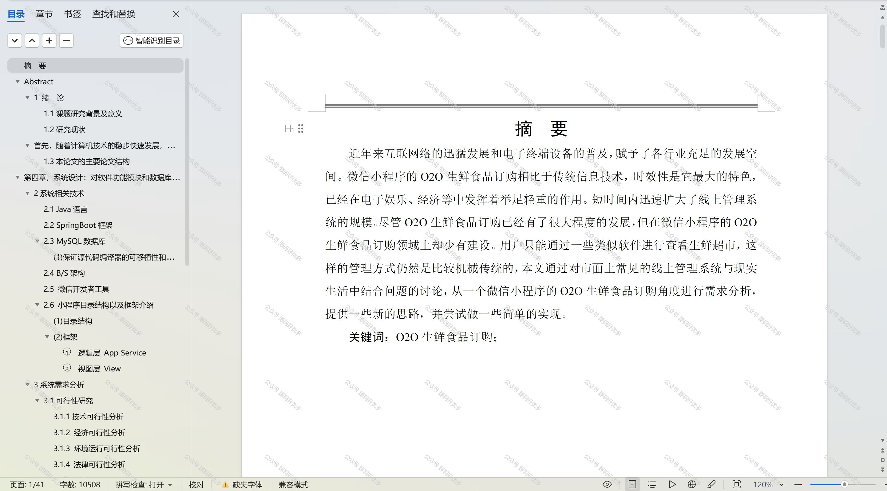

 
## 查看主页获取源码

> **作者介绍**： **✌**全网粉丝10W+本平台特邀作者、博客专家、CSDN新星计划导师、java领域优质创作者,博客之星、掘金/华为云/阿里云/InfoQ等平台优质作者、专注于项目实战 **✌**

  

### 一、作品包含

源码+数据库+设计文档万字+PPT+全套环境和工具资源+部署教程

### 二、项目技术

前端技术：Html、Css、Js、Vue、Element-ui

数据库：MySQL

后端技术：Java、Spring Boot、MyBatis

  

### 三、运行环境

开发工具：IDEA/eclipse + 微信开发者工具

数据库：MySQL5.7

数据库管理工具：Navicat10以上版本

环境配置软件： JDK1.8+Maven3.6.3

前端Nodejs：14

### 四、项目介绍
项目编号：mpweixinA009

生鲜食品订购微信小程序是一款集生鲜商品展示、选购、下单于一体的在线服务平台，旨在为用户提供新鲜、便捷的购物体验。通过这个小程序，用户可以轻松选购各类生鲜食品，如水果、蔬菜、肉类等，并享受快速配送服务，满足日常饮食需求，同时保证了食品的新鲜度和质量。小程序的设计简化了传统购物流程，让用户足不出户就能享受到优质的生鲜产品。

前台用户功能：浏览首页、生鲜超市、购物车、我的收藏管理、用户充值、在线客服、购物车、我的订单。

后台管理员的功能：系统首页、个人中心、用户管理、商品分类管理、生鲜超市管理、系统管理、订单管理。

### 五、运行截图

  
